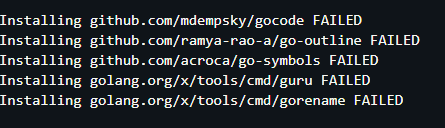

# VSCode 安装 Golang插件过程   

------

###  **1.遇到的问题**

 今天入了一个老哥的群(GO彩笔学习群),准备和大家一起学习GOlang，顺便搞搞ji。那么问题来了工欲善其事，必先利其器，一个好的IDE的选择直接决定了的开发体验。原来写laravel的时候一直使用的是JB家的，这次想换个口味，于是就打开了牛逼哄哄的VSCODE。好了好了这些都是题外话，重点来了，VSCODE很多GO的插件装不上去啊，如图：

怎么整？第一反应，梯子！对冒着两会期间被请去喝茶的风险，开了小飞机(shadowsocks)，但是PAC还是全局模式(梯子的网络模式)都试了，还是一直报这个错误。
然后去群里问了，群里老哥说手动安装，开始我是拒绝的，在网上找了各种方式，比如先下载GO的tools，然后再安装tools里面的，但是事实证明有很多包不是vscode需要的。最后只能妥协，手动搞一下。

###  **2.手动怎么搞？**
好的，下面看下手动怎么搞。下面是我在网上搜到的一段话，叙述的比较好，借鉴一下：

-----
>下面以：github.com/sqs/goreturns为例
1. 首先检查%gopath%src/github.com/sqs/goreturns目录下是否有内容
如果有跳到步骤3，否则继续步骤2
2. 到http://github.com/sqs/goreturns 直接下载zip文件
把该zip内的所有文件，拷贝到%gopath%src/github.com/sqs/goreturns
注意，有的插件在github中路径与vscode给出的不同，这时你可以自己搜索github网站，找到正确的路径
3. 在%gopath%bin目录（命令行cd到该目录），执行如下命令：
M:\gopath\bin>go install github.com/sqs/goreturns

----
我来解释一下，就是vscode下所有要装的包，会默认下载到你的GOPATH下面的src/github.com 文件夹下面，有的下载不下来，有的下载下来了，下载好的会安装成功，下载失败的就安装不了，就会报Install github.com/xxxxx/xxxxx FAILED的错误，那么你只需要按照这个失败的地址去gayhub上搜索，然后下载对应的zip包就可以，解压到src/github.com 对应的目录 ，然后安装上面的教程安装即可。注意有几个包给出的路径不对，注意一下就好了。

### **3.废话**
 上面的教程本人试了是可以的，如果不可以，那么在群里提出来大家一起去解决，解决了pr一下，以供后面的人参考，谢谢啦。一个好的学习环境，需要大家的努力。Fighting....

by CHERISH 2019/03/19
